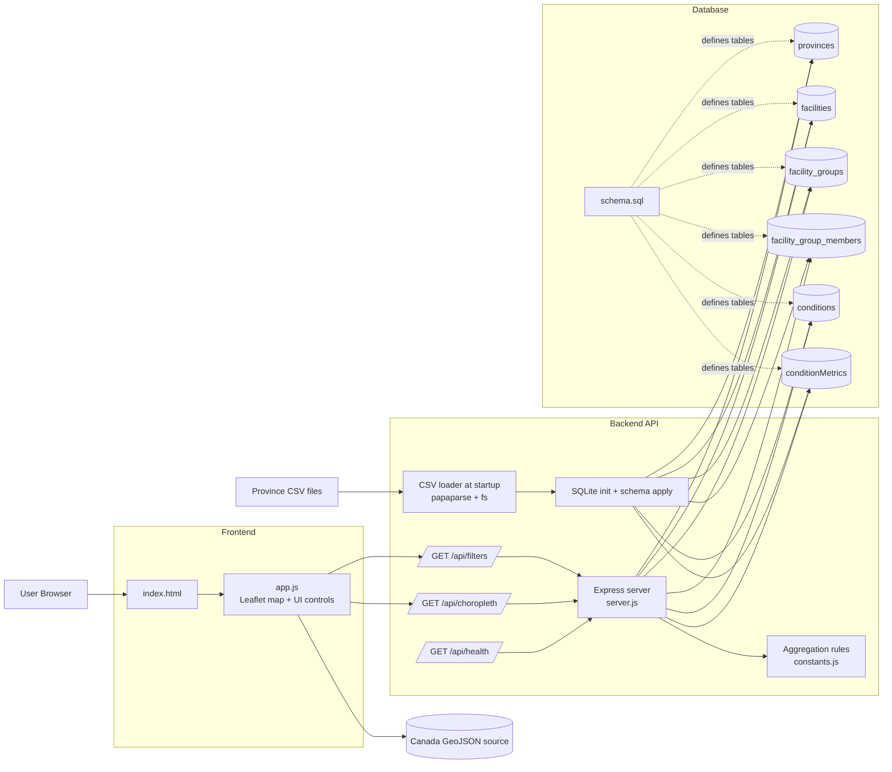

# Canada Choropleth Split: Frontend / Backend / Database

## Folder Structure

```text
choropleth map data/
  frontend/
    index.html
    app.js
  backend/
    package.json
    openapi.yaml
    src/
      server.js
      constants.js
  database/
    schema.sql
```

## Responsibilities

- Frontend:
  - Renders Leaflet map and UI controls.
  - Calls backend APIs for filter options and choropleth values.
  - Does not parse CSV directly.
- Backend:
  - Serves API endpoints.
  - Applies aggregation rules (single facility, grouped facility, all facilities, weighted score).
  - Loads CSV data into SQLite and reads API results from the database.
- Database:
  - Stores normalized facts and dimensions.
  - Supports fast aggregation queries for map responses.

## API Contract (High Level)

- `GET /api/health`
  - Returns service health.
- `GET /api/filters`
  - Returns `conditions` and `facilities` (including grouped/all options).
- `GET /api/choropleth?facility=__all_facilities__&condition=weighted_score`
  - Returns province values for the selected filters.
  - `condition` accepts normal conditions (`Good`, `Fair`, etc.) or `weighted_score`.

## Architecture Diagram (As-Is)



## Migration Notes

- Keep existing root `index.html` as legacy/reference.
- Move production UI to `frontend/`.
- Backend now loads CSVs into SQLite on startup and serves queries from DB tables.
